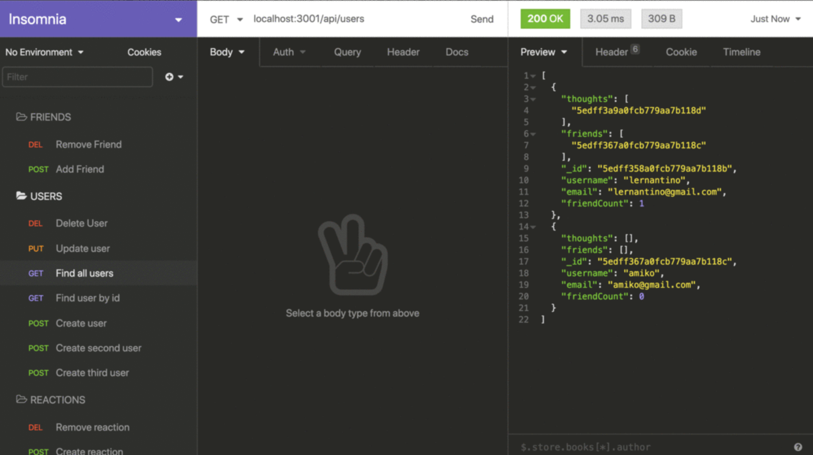

# Social-Network-API

This aplication was built API for a social network web application where users can share their thoughts, react to friends’ thoughts, and create a friend list.

## **Steps to get started:**
```
- npm i (+ dependencies)
- node server.js
```

## **Application Acceptance Criteria:**


## **Mock Up:**


## **Technology used:**
```
- Javascript
- Node.js
- Express.js
- MongoDB
```
